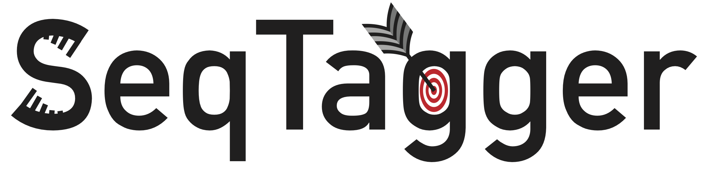

[](https://doi.org/10.1101/gr.279290.124)
[](https://x.com/novoalab?lang=en)
[](https://creativecommons.org/licenses/by-nc-nd/4.0/)

## Table of Contents
- [About-SeqTagger](#About-SeqTagger)
- [Running SeqTagger](#Running-SeqTagger)
- [Dependencies and versions](#Dependencies-and-versions)
- [License Information](#License-information)
- [Citation](#Citation)


SeqTagger is a super-fast and accurate demultiplexing algorithm for direct RNA nanopore sequencing datasets.
It supports the current sequencing chemistry (SQK-RNA004), and the deprecated chemistry (SQK-RNA002). 
SeqTagger expects reads in standard nanopore sequencing data format (pod5 or fast5). 

Running SeqTagger is as easy as:

```bash
docker run --gpus all -u $UID:$GID -v `pwd`:/data lpryszcz/seqtagger run -k models/b04_RNA004 -r -i /data/input_directory_with_reads -o /data/outdir
```

You can see available demultiplexing models by executing
```bash
docker run --gpus all -u $UID:$GID -v `pwd`:/data lpryszcz/seqtagger ls -lah models
```

You can find more information about
- [How does SeqTagger work?](docs/details.md#How-does-SeqTagger-work)
- [How many barcodes are supported?](docs/details.md#How-many-barcodes-are-supported)
- [Running SeqTagger](docs/details.md#Running-SeqTagger)
- [Benchmarking of b96_RNA004](docs/details.md#Benchmarking-of-b96_RNA004)

## Dependencies and versions

You'll need CUDA-compatible (Nvidia) GPU and 
[CUDA v10 or newer installed](https://developer.nvidia.com/cuda-downloads) 
in your system supporting **half-precision (float16)**. 
All Nvidia GPUs released from 2019 onward should work without any issues. 

Additionally, you'll need to install 
[docker](https://www.docker.com/)
and 
[NVIDIA Container Toolkit](https://docs.nvidia.com/datacenter/cloud-native/container-toolkit/latest/install-guide.html). 

Versions tested: 
| Software    | Version     | 
| ----------- | ----------- |
| CUDA        | 10, 11, 12  | 
| Docker      | 25+         | 
| Nvidia Container Toolkit | 1.14 | 

## License Information

This project is licensed under the Creative Commons Attribution-NonCommercial 4.0 International License (CC BY-NC-ND 4.0), 
available [here](https://creativecommons.org/licenses/by-nc-nd/4.0/), 
with the exception of the `bonito` module, which retains its original license. 
The full text of the licenses, including modified code, can be found in the `bonito` directory.

### License Dependencies

- **ONT 1.0**: `bonito`
  - Licensed under the Oxford Nanopore Technologies Public License 1.0. Full license text available at [ONT 1.0 License](https://github.com/nanoporetech/bonito/blob/master/LICENCE.txt).
- **MPL 2.0**: `pod5`, `ont_fast5_api`
  - Licensed under the Mozilla Public License 2.0. Full license text available at [MPL 2.0 License](https://www.mozilla.org/en-US/MPL/2.0/).
- **BSD 3-Clause**: `pandas`, `seaborn`, `joblib`, 
  - Licensed under the BSD 3-Clause License. Full license text available at [BSD 3-Clause License](https://opensource.org/licenses/BSD-3-Clause).
- **MIT**: `mappy`, `pysam`, `numpy`
  - Licensed under the MIT License. Full license text available at [MIT License](https://opensource.org/licenses/MIT).
- **OTHER**: `pytorch`, `numpy`
  - Full license text for `pytorch` is available at [pytorch License](https://github.com/pytorch/pytorch/blob/main/LICENSE).
  - Full license text for `numpy` is available at [numpy License](https://numpy.org/doc/stable/license.html).

Please ensure compliance with each license's terms and conditions.

### Patent Information

LPP, GD and EMN have filed patent applications (EP24382340 and EP24383144) based on this work at the European Patent Office. 

## Citation
If you found this work helpful, please cite:

Pryszcz LP*, Diensthuber G*, Llovera L,  Medina R, Delgado-Tejedor A, Cozzuto L, Ponomarenko J and Novoa EM#.
[**Rapid and accurate demultiplexing of
direct RNA nanopore sequencing datasets with SeqTagger**](https://genome.cshlp.org/content/early/2025/01/29/gr.279290.124.full.pdf). Genome Research 2025 
