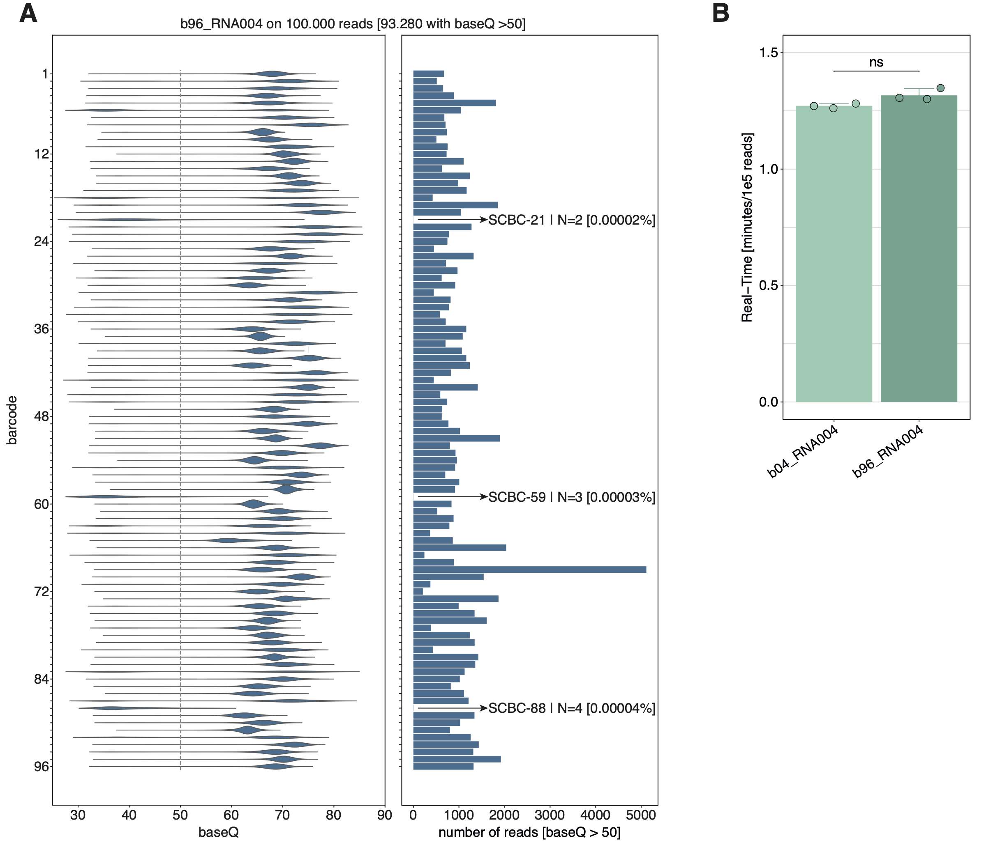

[](https://doi.org/10.1101/2024.10.29.620808)
[](https://x.com/novoalab?lang=en)
[](https://creativecommons.org/licenses/by-nc-nd/4.0/)

## Table of Contents
- [About-SeqTagger](#About-SeqTagger)
  - [What is SeqTagger?](#What-is-SeqTagger)
  - [How does SeqTagger work?](#How-does-SeqTagger-work)
  - [How many barcodes are supported?](#How-many-barcodes-are-supported)
  - [Does it work on all RNA types?](#Does-it-work-on-all-RNA-types)
- [Running SeqTagger](#Running-SeqTagger)
  - [Split reads by barcode](#Split-reads-by-barcode)
- [Dependencies and versions](#Dependencies-and-versions)
- [License Information](#License-information)
- [Citation](#Citation)

## About SeqTagger

### What is SeqTagger? 
It's a super-fast and accurate demultiplexing algorithm for direct RNA nanopore sequencing datasets.
Supporting both RNA002 and RNA004 kits, and both fast5 and pod5 files. 

### How does SeqTagger work? 
The workflow follows the standard direct RNA sequencing library preparation protocol in which default RT adapters are exchanged for barcode-containg RT adapters. SeqTagger then basecalls the DNA barcode from the direct RNA sequencing data using custom basecalling models. Finally, basecalled barcodes are aligned against the reference sequences for all barcodes and low confidence predicitions removed in a filtering step. 


### How many barcodes are supported?
Currently, SeqTagger supports the following models and barcodes:

| Chemistry | Number of barcodes | SeqTagger Model | Barcode Sequences | 
| :------:| :------: | :------: | :------: |
| RNA002 | 4 | b04_RNA002 | [b04_RNA002_barcodes](/models/b04_RNA002/barcodes.tsv)|
| RNA002 | 96 | b96_RNA002 | [b96_RNA002_barcodes](/models/b96_RNA002/barcodes.tsv)|
| RNA004 | 4 | b04_RNA004 |  [b04_RNA004_barcodes](/models/b04_RNA004/barcodes.tsv)|
| RNA004 | 96 | b96_RNA004 | [b96_RNA004_barcodes](/models/b96_RNA004/barcodes.tsv)|


**Please note:** The barcode sequences used for b04 and b96 are identical between the two chemistries RNA002 and RNA004.


### Does it work on all RNA types?
Yes, as long as the RNA molecule has a poly(A) tail (e.g. mRNAs, lncRNAs, etc.) or you have in vitro polyadenylated the sample prior to sequencing.

**Please note**: Nano-tRNAseq libraries do not have standard poly(A) RNA tails, and thus should not be used with the models listed above. You can find SeqTagger Dockerfiles with pre-trained **tRNA** demultiplexing models [here](https://www.immaginabiotech.com/nano-trnaseq-kit/ntrsq-12) (also available for **RNA004** chemistries).


## Running SeqTagger

Download test data for both RNA002 and RNA004:

```bash
mkdir -p seqtagger; cd seqtagger
wget https://public-docs.crg.es/enovoa/public/seqtagger/test_data/ \
  -q --show-progress -r -c -nc -np -nH --cut-dirs=3 --reject="index.html*"
```

It's handy to define an alias prior to using `seqtagger`:

```bash
alias seqtagger="docker run --gpus all -u $UID:$GID -v `pwd`:/data lpryszcz/seqtagger"
```
This will bind your current directory to `/data` in the docker container.

Then, running it is as easy as:

```bash
seqtagger mRNA -k models/b04_RNA004 -r -i /data/test_data/RNA004 -o /data/demux
```
Note, you can provide multiple input directories with fast5/pod5 files after `-i`. 

Results will be saved in tab-delimited files (gzip-compressed): 
`demux/RNA004.demux.tsv.gz`

In addition, boxplots of per-barcode quality will be saved in corresponding directory
ending with `.boxplot.pdf`. 

**Please note**:
You can now also run SeqTagger through the [MasterOfPores3](https://github.com/biocorecrg/master_of_pores) nextflow workflow. 

### Split reads by barcode

#### Split Fast5 files

If you wish to split Fast5 file(s) by barcode, execute:

```bash
seqtagger fast5_split_by_barcode.py -b 50 -i /data/demux/RNA004.demux.tsv.gz \
  -f /data/test_data/RNA004 -o /data/demux/RNA004 
```

Where `-b` specifies the baseQ cut-off. This will generate one output folder for each barcode named as
`demux/RNA004/bc_?/reads_*.fast5` where `?` represents the barcode number.

#### Split FastQ files

We don't provide FastQ example in the test_data. 
If you wish to split FastQ file(s) by barcode:

```bash
# first concatenate all FastQ file into one
cat guppy/run1/*.fastq.gz > guppy/run1.fastq.gz
# and split reads using baseQ cut-off of 50
seqtagger fastq_split_by_barcode.py -b 50 -o /data/demux/run1 -i /data/demux/run1.demux.tsv.gz -f /data/guppy/run1.fastq.gz
```

This will save one FastQ file for each barcode named as
`demux/run1.demux.bc_?.fq.gz` where `?` represents the barcode number.

#### Split BAM files

We don't provide BAM example in the test_data. 
If you wish to split BAM file(s) by barcode:

```bash
seqtagger bam_split_by_barcode.py -i /data/demux/run1.demux.tsv.gz -f /data/run1.mapped.bam -o /data/run1.mapped
```

This will save one BAM file for each barcode named as
`run1.mapped.bc_?.bam` where `?` represents the barcode number.

## Benchmarking of b96_RNA004

The confusion matrix below illustrates performance of the b96_RNA004 model on the holdout dataset, reaching >0.99 precision (recall = 1):


We further tested b96_RNA004 by performing a dropout test in which three randomly chosen barcodes were skipped during library generation (SCBC-21, SCBC-59, and SCBC-88).
This yielded an average cross-contamination rate per barcode of less than 0.00002% of the total library (**A**). We further compared the runtime of b04_RNA004 to that of the
larger b96_RNA004 model and observed no signficant differences (**B**).

**Please note**: This performance was obtained on a network filesystem, substantially faster times can be achieved on a local SSD or HDD.



## Dependencies and versions

You'll need CUDA-compatible (Nvidia) GPU and 
[CUDA v10 or newer installed](https://developer.nvidia.com/cuda-downloads) 
in your system. 

Additionally, you'll need to install 
[docker](https://www.docker.com/)
and 
[NVIDIA Container Toolkit](https://docs.nvidia.com/datacenter/cloud-native/container-toolkit/latest/install-guide.html). 

Versions tested: 
| Software    | Version     | 
| ----------- | ----------- |
| CUDA        | 10, 11, 12  | 
| Docker      | 25+         | 
| Nvidia Container Toolkit | 1.14 | 

## License Information

This project is licensed under the Creative Commons Attribution-NonCommercial 4.0 International License (CC BY-NC-ND 4.0), available [here](https://creativecommons.org/licenses/by-nc-nd/4.0/), with the exception of the `bonito` module, which retains its original license. The full text of the licenses, including modified code, can be found in the `bonito` directory.

### License Dependencies

- **ONT 1.0**: `bonito`
  - Licensed under the Oxford Nanopore Technologies Public License 1.0. Full license text available at [ONT 1.0 License](https://github.com/nanoporetech/bonito/blob/master/LICENCE.txt).
- **MPL 2.0**: `pod5`, `ont_fast5_api`
  - Licensed under the Mozilla Public License 2.0. Full license text available at [MPL 2.0 License](https://www.mozilla.org/en-US/MPL/2.0/).
- **BSD 3-Clause**: `pandas`, `seaborn`, `joblib`, 
  - Licensed under the BSD 3-Clause License. Full license text available at [BSD 3-Clause License](https://opensource.org/licenses/BSD-3-Clause).
- **MIT**: `mappy`, `pysam`, `numpy`
  - Licensed under the MIT License. Full license text available at [MIT License](https://opensource.org/licenses/MIT).
- **OTHER**: `pytorch`, `numpy`
  - Full license text for `pytorch` is available at [pytorch License](https://github.com/pytorch/pytorch/blob/main/LICENSE).
  - Full license text for `numpy` is available at [numpy License](https://numpy.org/doc/stable/license.html).

Please ensure compliance with each license's terms and conditions.

### Patent Information

LPP, GD and EMN have filed patent applications (EP24382340 and EP24383144) based on this work at the European Patent Office. 

## Citation
If you found this work helpful, please cite:

Pryszcz LP*, Diensthuber G*, Llovera L,  Medina R, Delgado-Tejedor A, Cozzuto L, Ponomarenko J and Novoa EM#.
[**Rapid and accurate demultiplexing of
direct RNA nanopore sequencing datasets with SeqTagger**](https://genome.cshlp.org/content/early/2025/01/29/gr.279290.124.full.pdf). Genome Research 2025 

